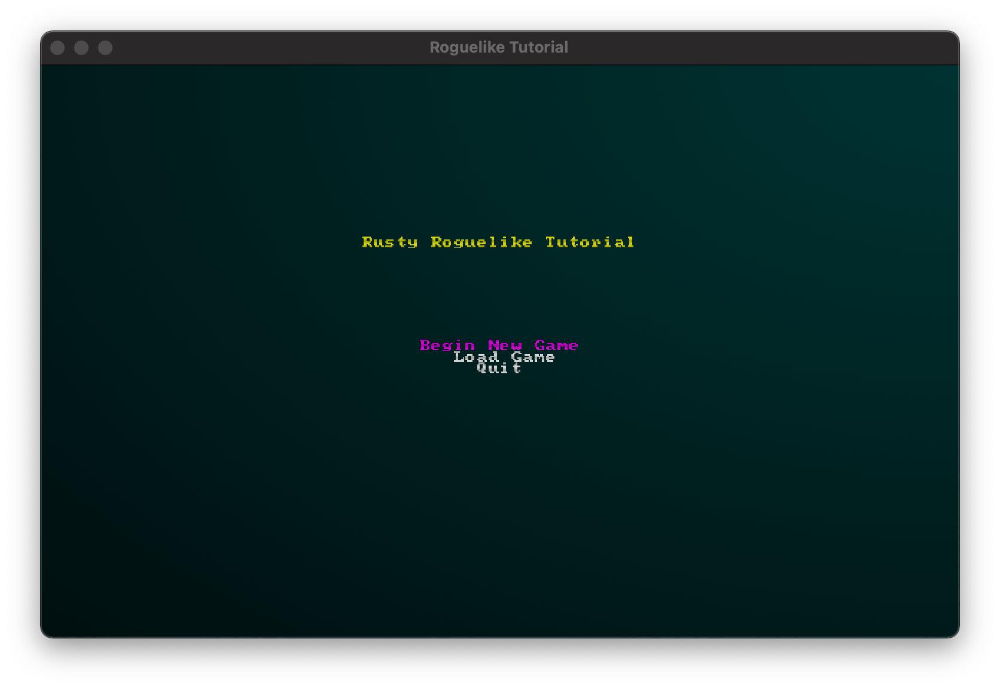
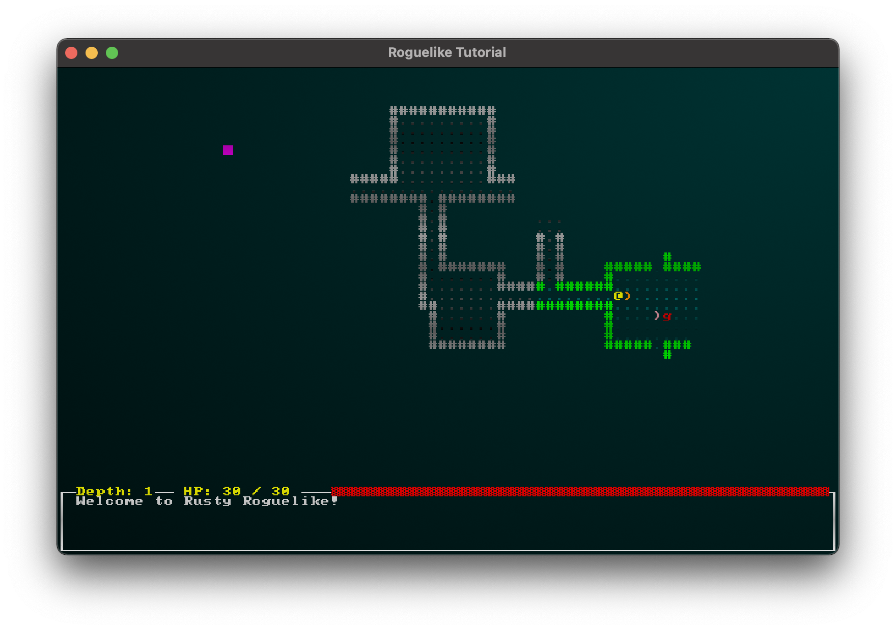
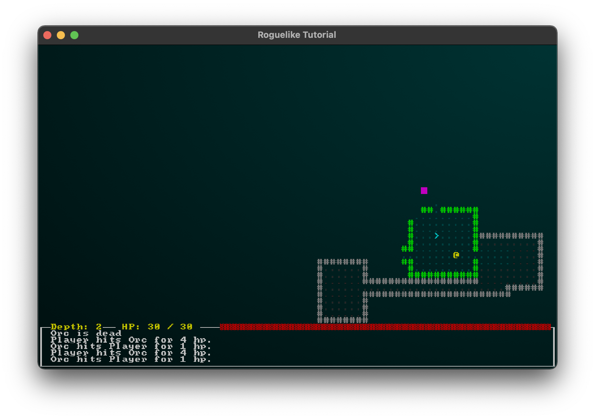
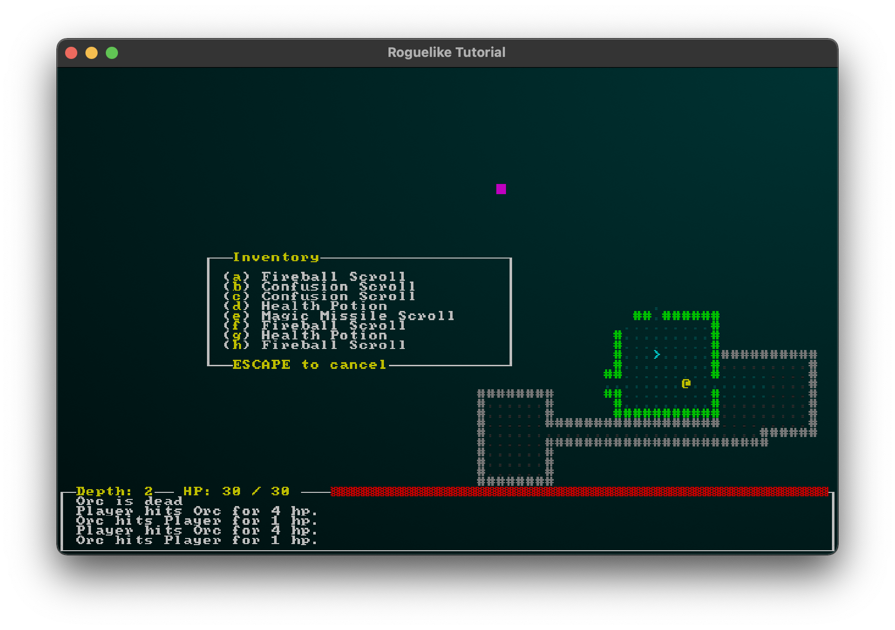
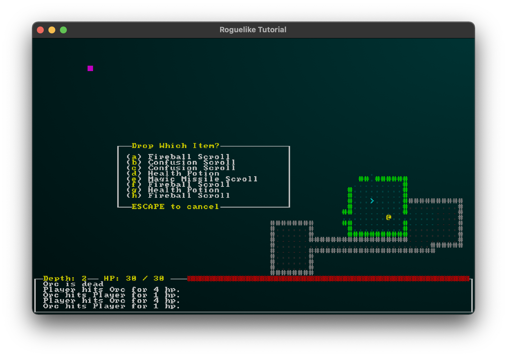
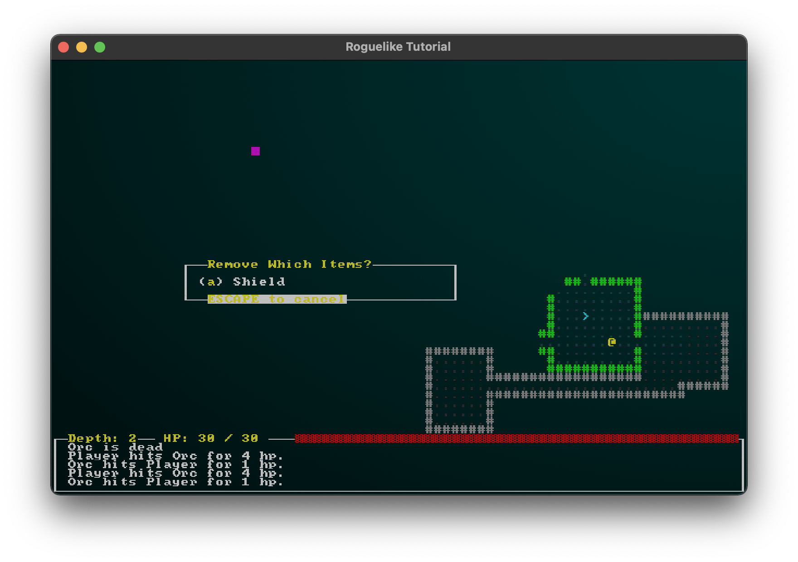
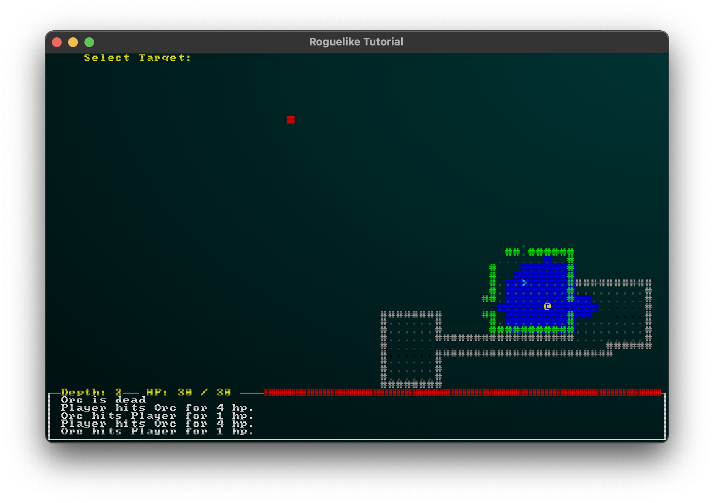

# Basic Roguelike Dungeon Crawler

Painfully simple dungeon crawler written with [bracket-lib](https://github.com/amethyst/bracket-lib), made closely following along with [Herbert Wolverson's phenomenal Roguelike Tutorial](https://bfnightly.bracketproductions.com/rustbook/).

## Playing the Game

To start up the game, simply `cargo run` from the root directory. After cargo gets all it's crates in order, the game window will pop up on the main menu screen. Selecting "Begin New Game" starts the game with a freshly generated map and randomized spawns.

On starting a new game, you're greeted with your player (a yellow `@`) and a room bounded by `#` (walls) and filled with `.` (floor tiles). You can navigate with either the arrow keys or an extended version of WSAD, which includes diagonal directions with (Q, E, Z, and C).

Enemies will be denoted with red letters (for example, a red `g` for a goblin), and items are a range of non-letter characters in a few colors. Staircases, taking you down a level, are represented with cyan `>`--you can go down these by pressing the period key (`.`) on top of one of these staircases.

The further you descend, the more enemies will spawn--but also the more loot you will find! Depth is handily noted on the UI at the bottom of the window, directly next to your health and above the game's log. Notable events, such as combat actions and interactions with the world, will be recorded here, so you can keep track of what's going on around you.

## Controls

| Key     | Action                                           |
| ------- | ------------------------------------------------ |
| `G`     | Pickup an item under the player.                 |
| `I`     | Open the inventory screen.                       |
| `P`     | Opens inventory in drop-item mode.               |
| `R`     | Opens your equipment screen to remove equipment. |
| `.`     | Descends a staircase.                            |
| `Esc`   | Saves the game and opens the menu.               |
| `Space` | Skips the current player turn, healing 1 hp.     |

## Screenshots

The inventory screen:

The drop-item screen:

Equipment removal:

Targeting interface:

